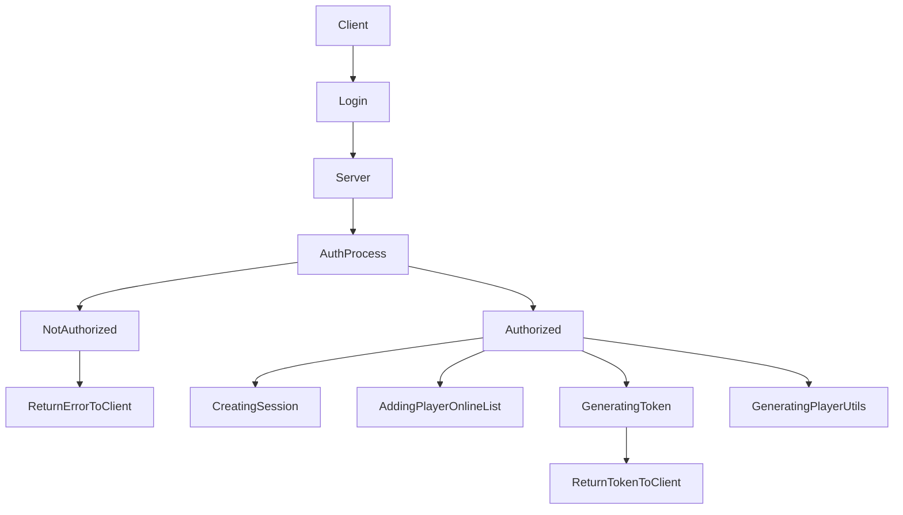

# core_ztzbx for ZTZBX Framework

### **Requirements**
- [language](https://github.com/ZTZBX/language)
- [fivem-mysql](https://github.com/ZTZBX/fivem-mysql)

To build it, run `build.cmd`. To run it, run the following commands to make a symbolic link in your server data directory:

```dos
cd /d [PATH TO THIS RESOURCE]
mklink /d X:\cfx-server-data\resources\[local]\core_ztzbx dist
```

Afterwards, you can use `ensure core_ztzbx` in your server.cfg or server console to start the resource.

### **Guide**
---

In your script you need to add the dependency in the fxmanifest.lua

```
dependencies {
    "core-ztzbx"
}
```

### **How the Auth works**

*This is not the best way to do it, but is pretty safe, if you got some ideas to make it more safe, just get in touch with me.*




### **Client Side**

**Send Message on concret User Chat**

```cs
Exports["core-ztzbx"].sendOnUserChat("Your chat message");
```

**Get The Player Token**

This will be fundamental to make interactions with the database

```cs
string token = Exports["core-ztzbx"].playerToken();
```

### **Server Side**

**Send Message on concret User Chat**

```cs
int source_id = Player.id;
Exports["core-ztzbx"].sendOnUserChat(source_id, "Your chat message");
```

**Login**

This will be use to login a user in the server

```cs
// this is the player id
int source_id = Player.id;

string username = "user";
string password = "pas1234";

List<string> user_pass = new List<string> {};

// first the username and after the password
user_pass.Add(username);
user_pass.Add(password);

string result = Exports["core-ztzbx"].login(source_id, user_pass);

if (result == "OK")
{
    // your process
}
else 
{
    Debug.WriteLine(result);
}

```

**Register player**

This will be use to register a user in the server

```cs
// this is the player id
int source_id = Player.id;

string username = "user";
string password = "pas1234";
string email = "test@mail.com";

List<string> user_pass = new List<string> {};

// add the credentials in the exact order
user_pass.Add(username);
user_pass.Add(password);
user_pass.Add(email);

string result = Exports["core-ztzbx"].register(source_id, user_pass);

if (result == "OK")
{
    // your process
}
else 
{
    Debug.WriteLine(result);
}
```

**Get the Player token**

```cs
// this is the player id
int source_id = Player.id;

// if token return "" thats mean the user isn't logged.
string token = Exports["core-ztzbx"].playerToken(source_id);
```

**Check if the user is admin**
```cs
// the idea is to do this with a event in the server side ho need the client token
// and another event in the client si ho got triggered from here to indicate if the user got pers to do an concret action.

// in this example i dont use the event i just call the exported event from the server side, but this is not the way to do it, is just an example.
string token = Exports["core-ztzbx"].playerToken(source_id);

bool isAdmin = Exports["core-ztzbx"].playerAdmin(token);

if (isAdmin())
{
    // trigger your event
}
else
{
    // trigger your event
}
```
